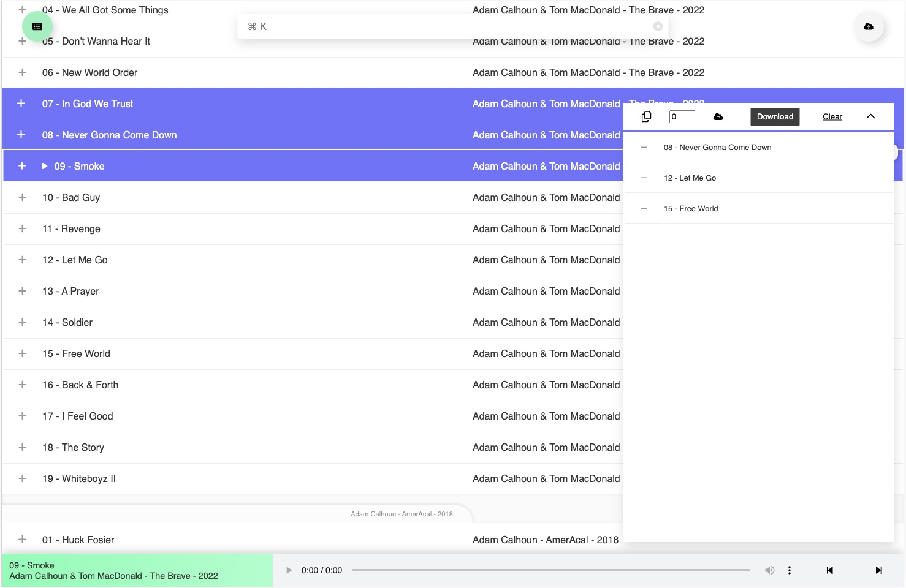

# Blaya



This project works in tandem with an S3 bucket, which is where the music is stored but you can set up a dev environment without S3 to get started.

## Development

### 1. Track list

Create a track list file in the `public/` dir.

```bash
$ touch public/track-list.js
```

And fill it with some pretend track urls, they follow a specific format,
[explained below](#track-list-syntax), but you can just copy this snippet for now.

```javascript
// public/track-list.js
export const trackList = [
	"music/All Them Witches - ATW - 2018/01 - Fishbelly 86 Onions.mp3",
	"music/All Them Witches - ATW - 2018/02 - Workhorse.mp3",
	"music/All Them Witches - ATW - 2018/03 - 1st vs. 2nd.mp3",
	"music/All Them Witches - ATW - 2018/04 - Half-Tongue.mp3",
];
```

### 2. Env Variables

Create an env file in the root of the project.

```bash
$ touch .env
```

Add a couple of variables (give it whatever port you want).

```bash
TEST=true
PORT=3000
# Optional (works if TEST=false)
BASIC_AUTH_USERS=bobuser:bobspassword
```

### 2. Install

Do the usual install

```bash
$ npm i
```

### 3. Run

Run with `dev`.

```bash
$ npm run dev
```

### 4. Testing

The player uses Cypress e2e testing, to open the Cypress UI.

```bash
$ npm run cypress:open
```

Do this in combination with `npm run dev`.

# Production

This project works by running an EC2 server in combination with an S3 bucket.
The reason for this is you can access S3 buckets for free if your app is served
via an EC2 instance. The other cost-saving advantage of this app is that it
doesn't have a database. All track data is saved in a single file which is read
and written from the S3 bucket using a server side script.

This means I can have as much or as little music stored as I want and I'll only
be charged for the amount of space I'm using in S3. Currently I have about 150GB
which costs under £4 per month.

### 1. Create Production Environment

Create an S3 bucket and an EC2 instance with access to it. Also make sure you
have cli access to the EC2. 

Log into the EC2 and clone this repo.

### 2. Track list 

Generate a track list file from your S3 bucket by running the `ls_s3.sh` script.

```bash
$ chmod +x ls_s3.sh
$ ./ls_s3.sh
```

This will have made a `track-list.js` file in the `public/` dir with all the tracks
stored in your S3 bucket. Note that the `ls_s3.sh` script uses awscli to access
s3 so you have to have it configured to work.

### 3. Https

You have to run the app on https as it uses sockets in development and
production. Point a domain at the EC2 using a DNS provider and AWS Elastic IP
and then you can use [Certbot](https://certbot.eff.org/) to set up the "s" part
of the https once you have cli access to EC2.

### 4. Env Variables

The live env variables look like:

```bash
BASIC_AUTH_USERS=<myusername>:<mypassword>
PORT=443
CERTIFICATE=/etc/letsencrypt/live/<mydomain>/fullchain.pem
PRIV_KEY=/etc/letsencrypt/live/<mydomain>/privkey.pem
ENVIRONMENT=production
```

`CERTIFICATE` and `PRIV_KEY` should be easy to find from Certbot when you
finish setting that up.

### 5. Install and run

I don't have any background process worker installed in the app as I use
[Tmux](https://github.com/tmux/tmux/wiki). If you want to install something
else I'd recommend [PM2](https://github.com/Unitech/pm2).

You can install and run the app with.

```bash
$ npm i && npm run start
```

<h2 id="track-list-syntax">Track list syntax</h2>

Track list strings have the following format:

```
"music/<artist> - <album> - <year>/<track number> - <Track name>.mp3"
```

This allows the player to split the string and format it in the UI without
having to look for metadata or store any database records.
